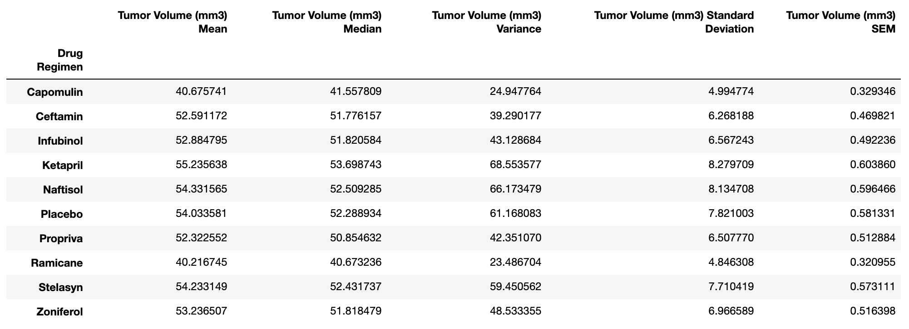
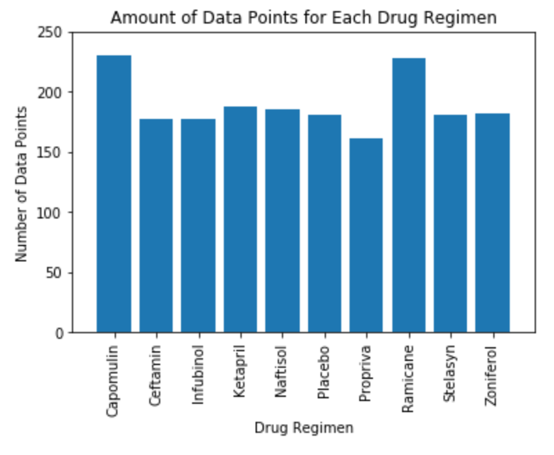
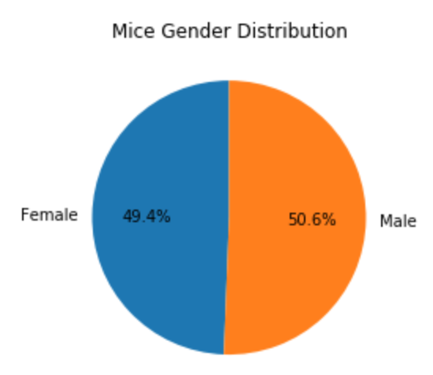
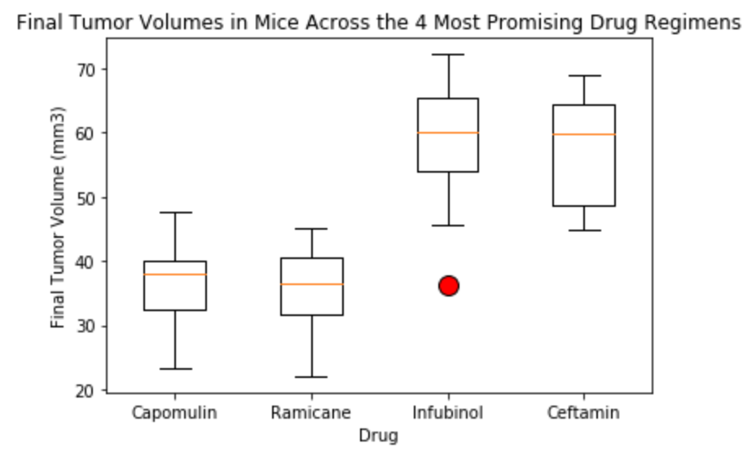
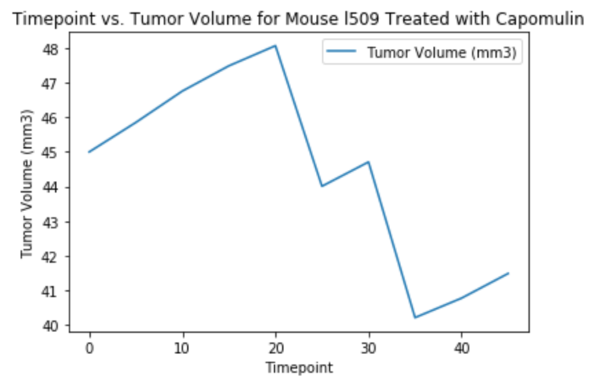

### Problem this analysis is trying to solve:
In this study, 250 mice identified with SCC tumor growth were treated through a variety of drug regimens. Over the course of 45 days, tumor development was observed and measured. The purpose of this analysis was to compare the performance of the drug, Capomulin, to the other drugs by generating tables and figures and developing a summary based on the results.

### How to run the code:
1. Download and save the files "pymaceuticals.ipynb", "Mouse_metadata.csv", and "Study_results.csv" in the repository to a folder on your computer.
1. Open your terminal.
1. cd into the folder you saved the files in.
1. Run the command "jupyter notebook". This will open the folder in the Jupyter Notebook website.
1. Open up the pymaceuticals.ipynb file on Jupyter Notebook.
1. At the top, under the "Kernal" tab, click "Restart & Run All". This will run all the cells on the page and display all the dataframes graphs.

### Data Collected:

### Why the data is displayed this way:
The data for the tumor volume statistics for the various drugs is displayed in a dataframe so you can quickly compare the mean, median, variance, standard deviation, and SEM of the tumor volume of each drug to one another. The amount of data points for each drug regimen is displayed in a bar graph because the x-axis values are qualitive data. The mice gender distribution is displayed in a pie chart, since it is showing percentages. The fianl tumor volumes for the 4 drugs are displayed in a box plot so you can easily see the medians and if there are any outliers in the data sets. The timepoint vs. tumor volume for mouse I509 with capomulin is displayed in a line graph because it's showing change in tumor volume over time. The mouse weight vs. average tumor volume for capomulin is displayed in a scatter plot with a regression line so you can see if there is any correlation between weight have average tumor volume.
